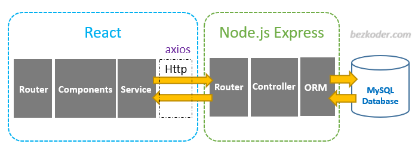
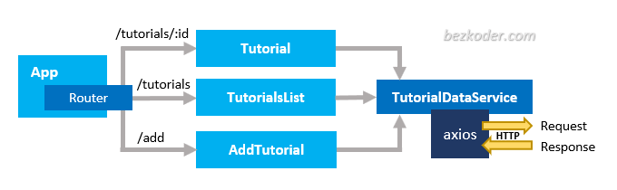

# Merx

## Architure

## Theory

* Session: The data stored in the serve(Database, Redis)

* Cookie: The data stored in the client

> Get key from cookie in the client, send to serve to access value in the session

> When browser open the website, serve create a session and send a cookie what stored key to client